1. 列表模式下 路径信息显示高度和其他信息不一样

2. 存在两条分界线
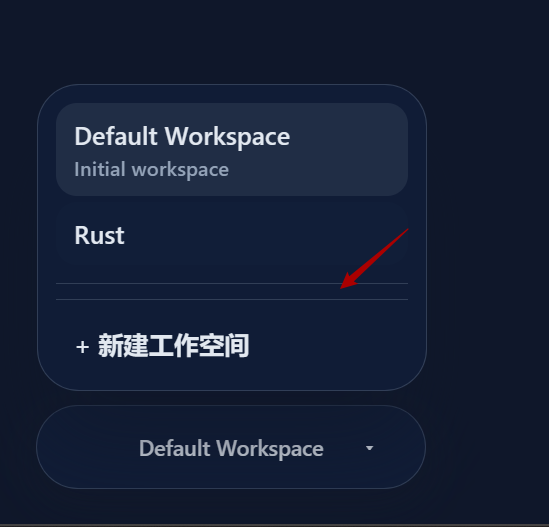

3. 没有统一圆角风格
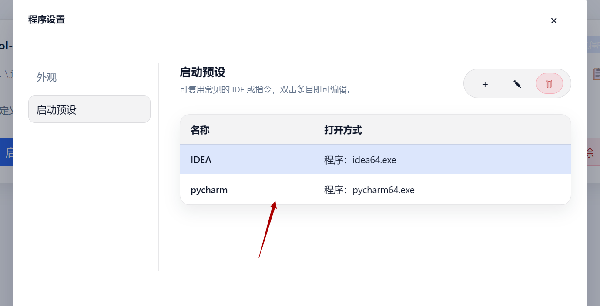

4. 设置弹窗只在右下角有改变整体比例的设置，左右边界均不可以拖动改变大小

5. 整体外观修改，风格参考建议(可以去联网搜索软件界面，了解他们前端构造信息)
5.1 reqable
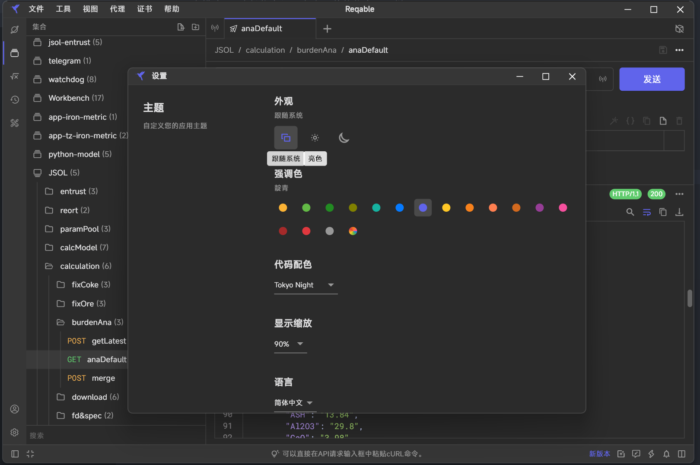

5.2 tiny RDM
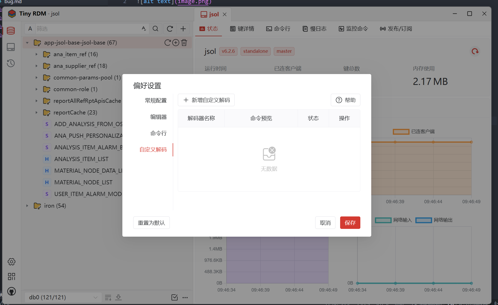
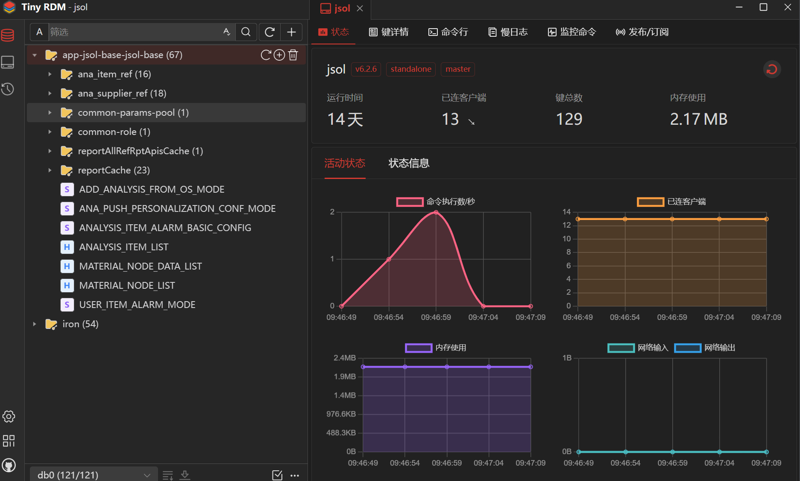

6. 设置和编辑弹窗的文本框占比不太合理，重新调整一下占比，使其更加美观合理，
截图中的文字太大导致不太美观，建议允许将整体字体的最小值改到8

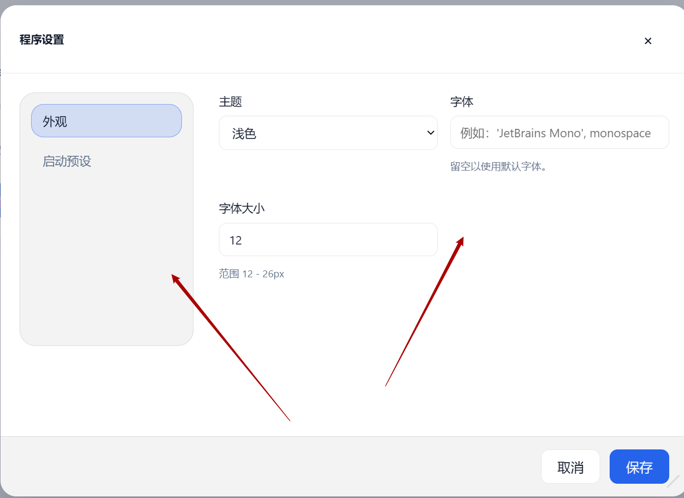

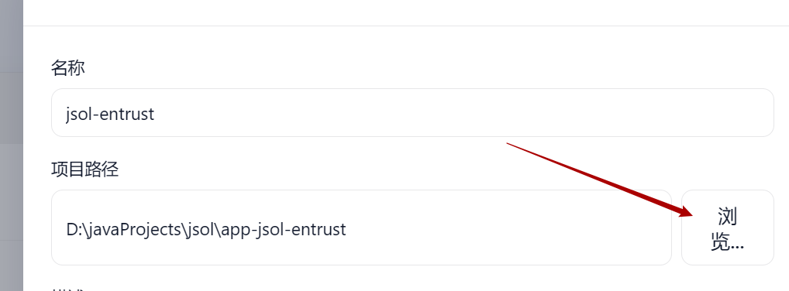

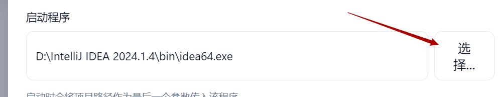

7. 导入项目下拉框bug
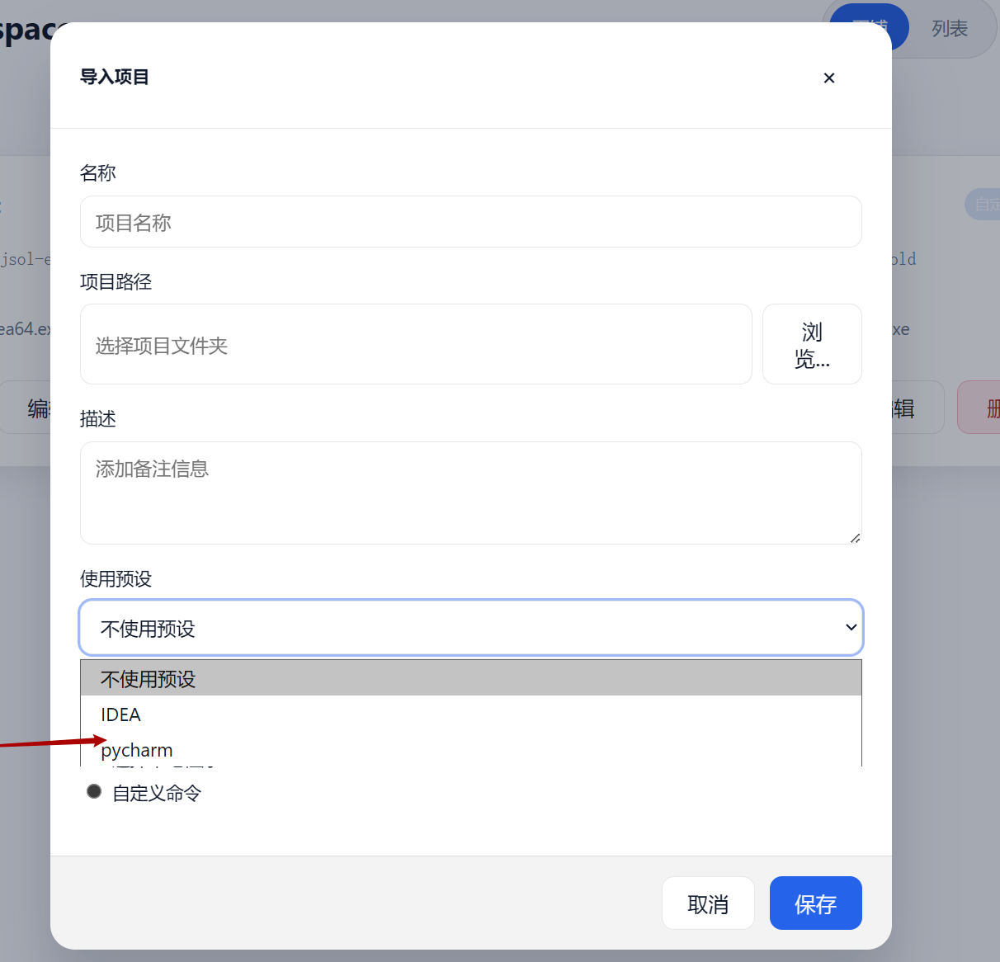

8. 取消编辑页面滚动条
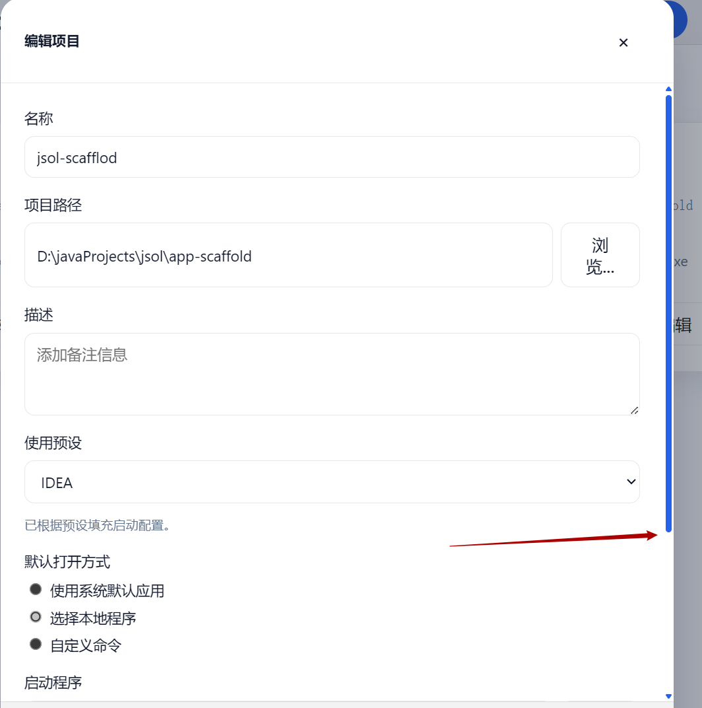

9. 所有弹窗中的文本配置框长度适当减小，过长了不太美观，可以采用居中的形式，而非靠左
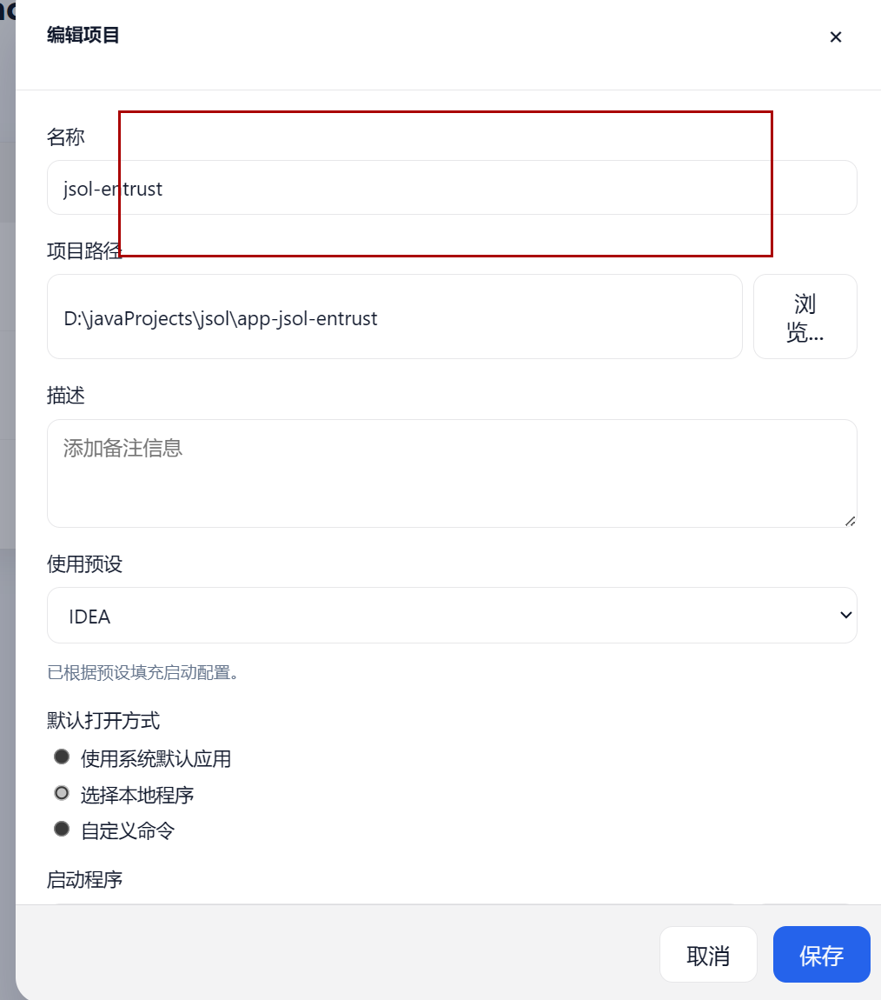

10. 配置界面左侧菜单栏太宽，需要紧凑一点
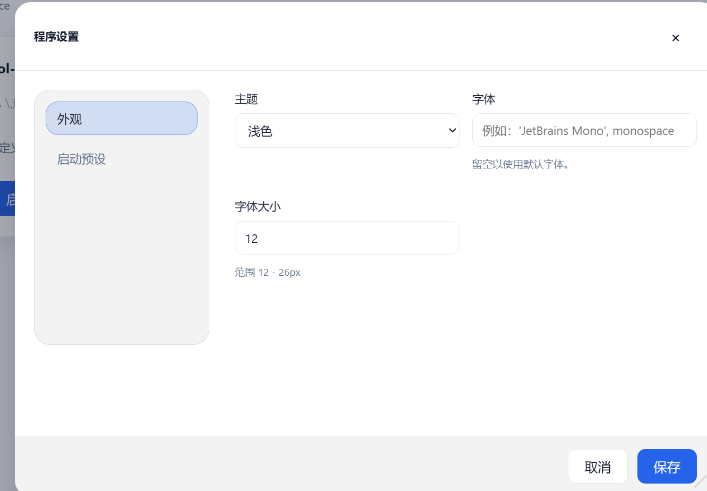

11. 所有布局尽量采用居中布局，如果导致格式错乱则默认还是使用靠左形式

12. 在设置界面，左侧的导航栏不会随着弹窗界面的大小更改而动态变化，大小宽度应该是被固定了，
缩放状态下仍有一个滚动条，请去掉，但是要保留滚动功能，
image-14展示的是一个较小状态下，设置页面的效果，请你根据前面的风格要求把它修改，使其美观合理，放缩正常
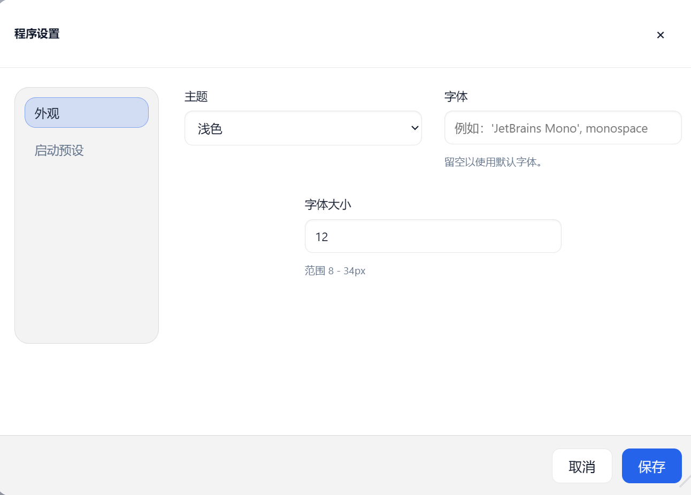
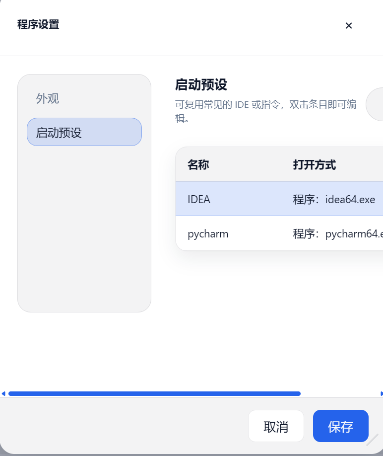

13. 列表界面字体大小不一致，将每个列表的宽度减小，使其更加紧凑集中，每个列表应该有一定间隔，自行调整，使其更加美观
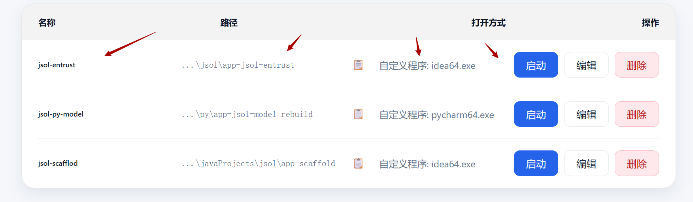

14. 深色主题的颜色修改成下面这个颜色
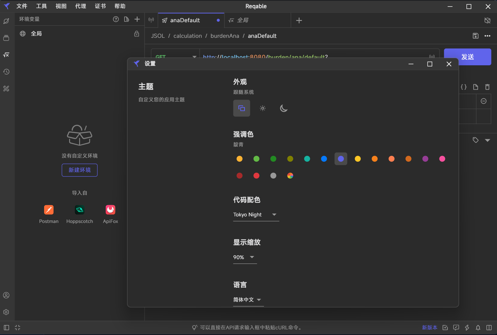

